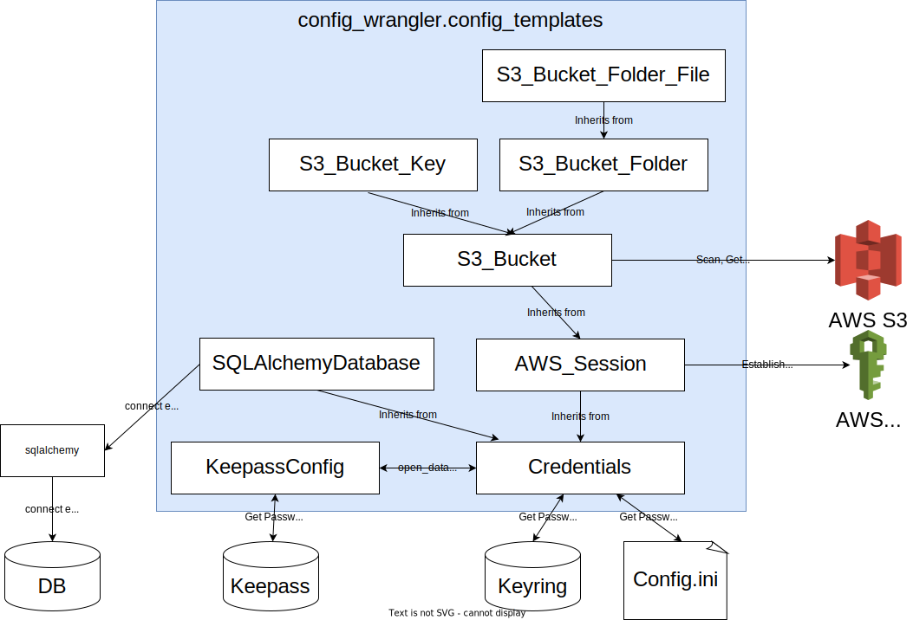

****************
Config Templates
****************

The config_templates package contains some templates for configuring common services.

* :class:`config_wrangler.config_templates.credentials.Credentials`
* :class:`config_wrangler.config_templates.sqlalchemy_database.SQLAlchemyDatabase`
* :class:`config_wrangler.config_templates.aws.aws_session.AWS_Session`
* :class:`config_wrangler.config_templates.aws.dynamodb.DynamoDB`
* :class:`config_wrangler.config_templates.aws.dynamodb.DynamoDBTable`
* :class:`config_wrangler.config_templates.aws.s3_bucket.S3_Bucket`
* :class:`config_wrangler.config_templates.aws.s3_bucket.S3_Bucket_Folder`
* :class:`config_wrangler.config_templates.aws.s3_bucket.S3_Bucket_Folder_File`
* :class:`config_wrangler.config_templates.aws.s3_bucket.S3_Bucket_Key`
